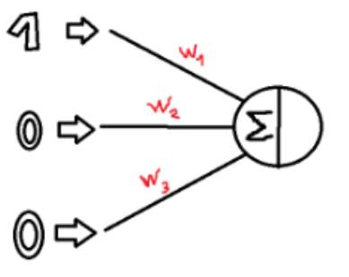
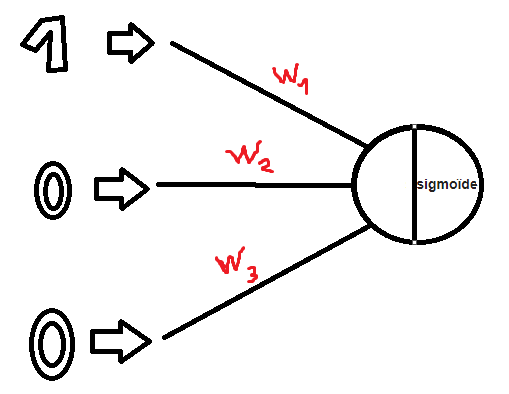
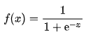

# NeuralNetwork

Create a simple neural network and testing with a simple example

## For what

There is the minimum code to begin with easy examples which use simple data such as math operations (XOR, NAND, ...)

## How to use

- There is inputs and outputs in main class which are data to your examples
- After training with these data, there is a testing phase in order to test with new data to know if your neural network works correctly

## How to work Neural Network

### Before training

- We have some inputs and the results of these inputs such as :
  
            |Inputs |Outputs |
            |-------|--------|
            |0, 0, 1| 0      |
            |1, 1, 1| 1      |
            |1, 0, 1| 1      |
            |0, 1, 1| 0      |

            > A row represent 3 inputs (3 neurons in input layer) and 1 output (1 neuron in output layer)
- Moreover, we have some weights for every synapse choosed randomly

### During training

- We multiply the matrix of inputs values and the matrix of their weights
- A bias is added during this sum : **∑ (values + weights) + bias** (*from 1 to n neurons*) :
  
- After that, we send this matrix of outputs results in sigmoid function :
  
  - Sigmoid Function :
     
    - x is the **∑** result.

- Backpropagation :
  - We compute the *error*

!! NOT FINISHED YET !!